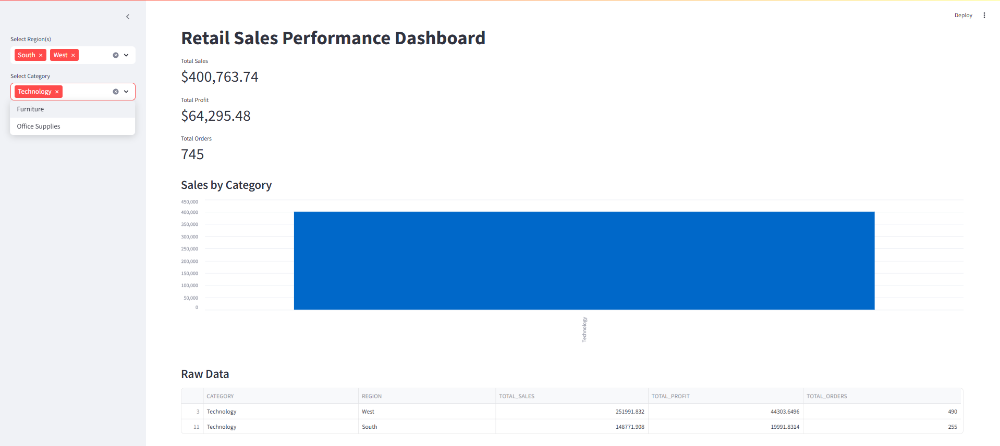

# Retail Sales Performance Tracker

This project demonstrates an end-to-end data pipeline using the Superstore sales dataset. The goal is to load, transform, and analyze retail performance metrics such as sales, profit, and discounts by region, category, and time.

The pipeline uses Snowflake as the cloud data warehouse, dbt for data modeling and transformation, and Streamlit for dashboarding. Python is used for data ingestion and Snowflake interaction.

---

## Project Overview

The dataset contains historical sales records, including:

- Order and shipment dates
- Customer and regional information
- Product details by category and sub-category
- Metrics such as sales, quantity, profit, and discount

The pipeline focuses on turning raw CSV data into structured, queryable tables and presenting insights through a web dashboard.

---

## Tools and Technologies

- **Python** – For data ingestion and automation
- **Snowflake** – Cloud data warehouse
- **dbt (data build tool)** – SQL-based transformations, testing, and lineage
- **Streamlit** – Interactive analytics dashboard
- **GitHub Actions** – CI/CD automation
- **Git & GitHub** – Version control

---

## Dataset

- **Source**: [Kaggle – Superstore Sales Dataset](https://www.kaggle.com/datasets/vivek468/superstore-dataset-final)
- **License**: Public dataset for educational and portfolio use

---

## How to Run This Project

### 1. Clone the repository

```bash
git clone https://github.com/simimathew1898/Retail-Sales-Performance-Tracker.git
cd Retail-Sales-Performance-Tracker
```

### 2. Install Python dependencies

```bash
pip install -r requirements.txt
```

### 3. Prepare your environment

- Place the `Superstore.csv` dataset inside the `data/` folder.
- Create a Snowflake account (if not already done).
- Create your warehouse, database (`SUPERSTORE_DB`), schema (`RAW`, `STAGING`), and table using the provided script.

### 4. Upload data to Snowflake

Edit your credentials in the `.env` file (see below), then run:

```bash
python scripts/upload_to_snowflake.py
```

---

## dbt Project

### Setup

Make sure `dbt-snowflake` is installed:

```bash
pip install dbt-snowflake
```

Update your `~/.dbt/profiles.yml` with your Snowflake credentials. Then run:

```bash
cd dbt_project
dbt debug      # to test connection
dbt run        # to build models
dbt test       # to run column tests
dbt docs serve # to view documentation at localhost:8000
```

Models included:
- `stg_orders`
- `fct_sales`
- `fct_sales_by_month`
- `fct_sales_rolling_avg`
- `fct_sales_by_month_ytd`

---

## Streamlit Dashboard

The dashboard connects to the `fct_sales` table in Snowflake and provides filters, KPIs, and charts.

### Running the Dashboard Locally

1. Install required packages:

```bash
pip install streamlit snowflake-connector-python python-dotenv
```

2. Create a `.env` file in the project root (this file is ignored by Git) with your Snowflake credentials:

```
SNOWFLAKE_USER=your_username
SNOWFLAKE_PASSWORD=your_password
SNOWFLAKE_ACCOUNT=goyjbep-ib68545
SNOWFLAKE_WAREHOUSE=DEMO_WH
SNOWFLAKE_DATABASE=SUPERSTORE_DB
SNOWFLAKE_SCHEMA=STAGING
```

3. Start the app:

```bash
streamlit run streamlit_dashboard/app.py
```

The dashboard will open in your browser at `http://localhost:8501`.


## Streamlit Dashboard

```bash
streamlit run streamlit_dashboard/app.py
```

### Dashboard Preview




The dashboard displays:

- KPI cards: total sales, profit, and order count
- Line chart: 3-month rolling average of sales
- Line chart: Year-to-date (YTD) sales trend
- Category-level sales breakdown by region

---

## GitHub Actions: CI/CD

This project includes a **manual CI workflow** using GitHub Actions.

You can trigger the workflow from the GitHub **Actions tab**, and it will:

- Set up Python and install dbt dependencies
- Use a securely stored `DBT_PROFILE` secret to connect to Snowflake
- Run `dbt debug`, `dbt run`, and `dbt test` to validate all models

The workflow file is located at:

```
.github/workflows/dbt_ci.yml
```

To trigger it manually:
1. Go to your repo's **Actions** tab
2. Select the `CI for dbt + Python` workflow
3. Click **Run workflow**

This allows you to validate all your dbt transformations on-demand without using Snowflake credits unnecessarily on every push.


---

## Project Structure

```
Retail-Sales-Performance-Tracker/
├── data/                      # Raw dataset (not pushed)
├── dbt_project/               # dbt models and config
├── diagrams/                  # Dashboard preview and visuals
├── scripts/                   # Python upload scripts
├── streamlit_dashboard/       # Dashboard and connector code
├── .github/workflows/         # CI pipeline config
├── .env                       # Snowflake credentials (ignored)
├── .gitignore
├── README.md
└── requirements.txt
```

---

## License

This project is for educational use only. Dataset is publicly available and used under Kaggle’s open dataset policy.


