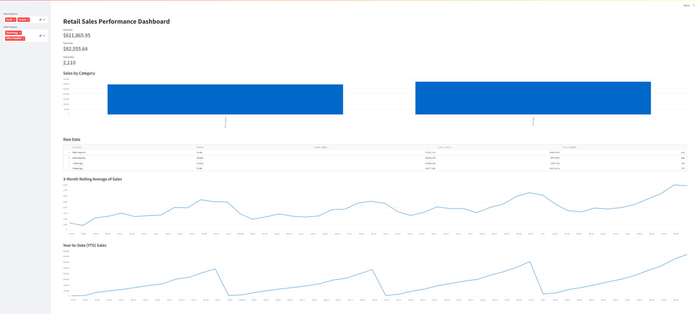

# Retail Sales Performance Tracker

This project demonstrates an end-to-end data pipeline using the Superstore sales dataset. The goal is to load, transform, and analyze retail performance metrics such as sales, profit, and discounts by region, category, and time.

The pipeline uses Snowflake as the cloud data warehouse, dbt for data modeling and transformation, and Streamlit for dashboarding. Python is used for data ingestion and Snowflake interaction.

---

## Project Overview

The dataset contains historical sales records, including:

- Order and shipment dates
- Customer and regional information
- Product details by category and sub-category
- Metrics such as sales, quantity, profit, and discount

The pipeline focuses on turning raw CSV data into structured, queryable tables and presenting insights through a web dashboard.

---

## Tools and Technologies

- **Python** – Used for reading, cleaning, and uploading CSV data to Snowflake
- **Snowflake** – Cloud-based data warehouse for storing raw and transformed data
- **dbt** – For SQL-based data modeling, transformations, and documentation
- **Streamlit** – For building an interactive business dashboard
- **Git & GitHub** – Version control and documentation

---

## Dataset

- **Source**: [Kaggle – Superstore Sales Dataset](https://www.kaggle.com/datasets/vivek468/superstore-dataset-final)
- **License**: Public dataset for educational and portfolio use

---

## How to Run This Project

### 1. Clone the repository

```bash
git clone https://github.com/simimathew1898/Retail-Sales-Performance-Tracker.git
cd Retail-Sales-Performance-Tracker
```

### 2. Install Python dependencies

```bash
pip install -r requirements.txt
```

### 3. Prepare your environment

- Place the `Superstore.csv` dataset inside the `data/` folder.
- Create a Snowflake account (if not already done).
- Create your warehouse, database (`SUPERSTORE_DB`), schema (`RAW`, `STAGING`), and table using the provided script.

### 4. Upload data to Snowflake

Edit your credentials in the `.env` file (see below), then run:

```bash
python scripts/upload_to_snowflake.py
```

---

## dbt Project

### Setup

Make sure `dbt-snowflake` is installed:

```bash
pip install dbt-snowflake
```

Update your `~/.dbt/profiles.yml` with your Snowflake credentials. Then run:

```bash
cd dbt_project
dbt debug      # to test connection
dbt run        # to build models
dbt test       # to run column tests
dbt docs serve # to view documentation at localhost:8000
```

---

## Streamlit Dashboard

The dashboard connects to the `fct_sales` table in Snowflake and provides filters, KPIs, and charts.

### Running the Dashboard Locally

1. Install required packages:

```bash
pip install streamlit snowflake-connector-python python-dotenv
```

2. Create a `.env` file in the project root (this file is ignored by Git) with your Snowflake credentials:

```
SNOWFLAKE_USER=your_username
SNOWFLAKE_PASSWORD=your_password
SNOWFLAKE_ACCOUNT=goyjbep-ib68545
SNOWFLAKE_WAREHOUSE=DEMO_WH
SNOWFLAKE_DATABASE=SUPERSTORE_DB
SNOWFLAKE_SCHEMA=STAGING
```

3. Start the app:

```bash
streamlit run streamlit_dashboard/app.py
```

The dashboard will open in your browser at `http://localhost:8501`.

---

### Dashboard Preview



---

## Project Structure

```
Retail-Sales-Performance-Tracker/
├── data/                        # Raw CSV data (not committed)
├── dbt_project/                 # dbt models and config
├── diagrams/                    # ERDs or screenshots (optional)
├── scripts/                     # Python upload scripts
├── streamlit_dashboard/         # Streamlit app and Snowflake connector
├── .gitignore
├── README.md
└── requirements.txt
```

---

## About

This project was created as part of a portfolio effort to demonstrate end-to-end data engineering concepts including ingestion, modeling, testing, and reporting using cloud-native and open-source tools. It is suitable for showcasing during technical interviews or as part of a public GitHub portfolio.

---

## License

This project is for educational use only. Dataset is publicly available and used under Kaggle’s open dataset policy.


